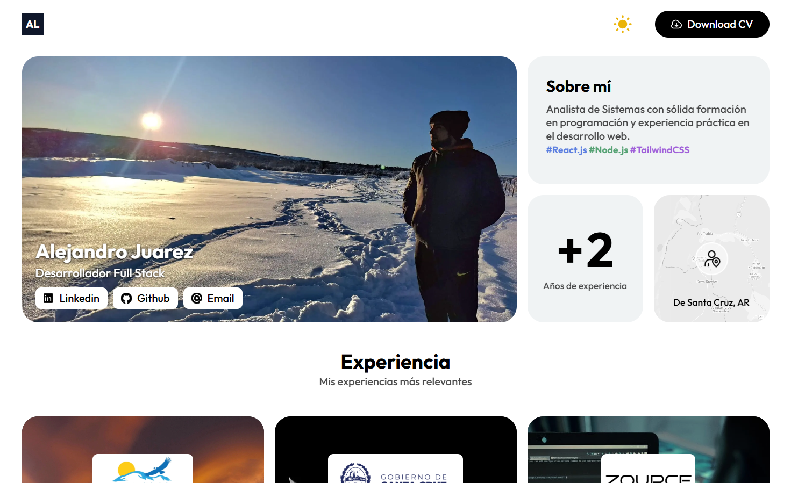
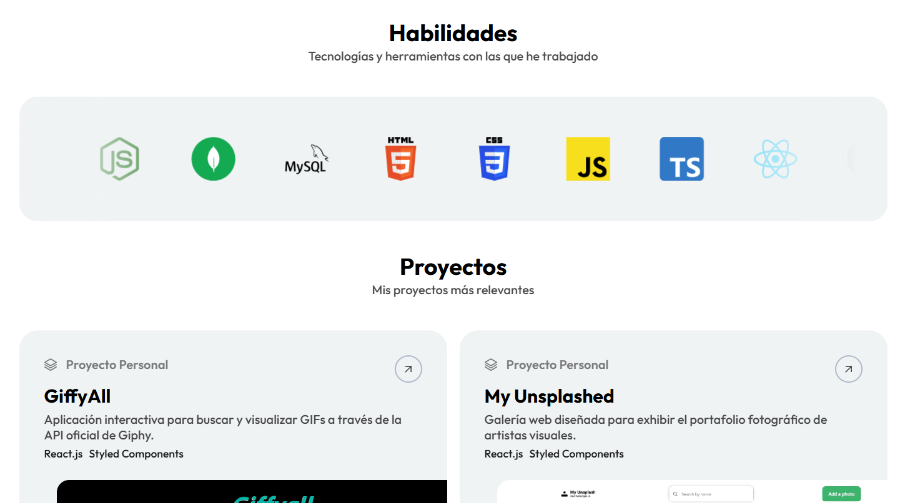

# Alejandro Juarez Portfolio

Personal portfolio website built with Astro and Tailwind CSS.

## Overview

This project showcases:

- About/profile section
- Work experience cards
- Skills carousel
- Project gallery
- Contact links and CV download
- Light/dark mode toggle

## Tech Stack

- Astro 4
- Tailwind CSS 3
- TypeScript
- Vanilla JavaScript (small client-side interactions)

## Requirements

- Node.js `>=20`
- npm

## Getting Started

Install dependencies:

```bash
npm install
```

Run development server:

```bash
npm run dev
```

The app runs at `http://localhost:4321`.

## Scripts

- `npm run dev`: start local dev server
- `npm run start`: alias of `dev`
- `npm run build`: type-check (`astro check`) and build static output
- `npm run preview`: preview production build locally
- `npm run astro`: run Astro CLI commands

## Project Structure

```text
/
|-- public/
|-- src/
|   |-- assets/
|   |   |-- css/
|   |   |-- fonts/
|   |   |-- img/
|   |   `-- json/
|   |-- components/
|   |   `-- About/
|   |-- js/
|   |-- layouts/
|   `-- pages/
|-- astro.config.mjs
|-- tailwind.config.mjs
`-- package.json
```

## Content Sources

Most editable content is centralized in JSON files:

- `src/assets/json/Experiences.json`
- `src/assets/json/Projects.json`
- `src/assets/json/Skills.json`

## Styling and UI Behavior

- Global styles and animations live in `src/assets/css/`.
- Layout and shared page shell live in `src/layouts/Layout.astro`.
- Section composition starts from `src/pages/index.astro`.
- Client interactions:
  - `src/js/darkModeListener.ts`
  - `src/js/intersectionObserver.ts`
  - `src/js/OnProjectHover.ts`

## Build Output

This is a static Astro site. Production files are generated in:

- `dist/`

## Deployment

Any static hosting service can be used (Netlify, Vercel, GitHub Pages, Cloudflare Pages, etc.):

1. Run `npm run build`
2. Deploy the `dist/` directory

## Screenshots



